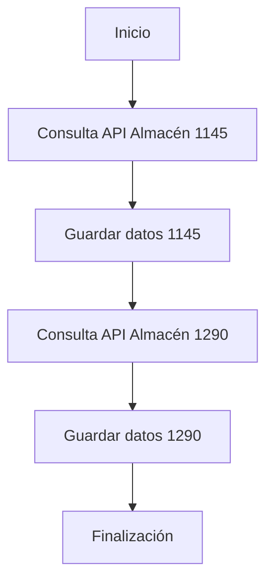

# API Data Collector Optimizado

Colector automatizado de datos de transacciones para múltiples almacenes.

## 🔧 Configuración

1. Configura estos secrets en GitHub:
   - `API_TOKEN`: Tu token de autenticación
   - `API_BASE_URL`: URL base del endpoint API

2. Variables opcionales:
   - `WAREHOUSE_CODES`: Códigos de almacén separados por comas (default: "1145,1290")

## ⚙️ Funcionamiento

El workflow se ejecuta diariamente a las 2 AM (hora Colombia).

## 📊 Salida

Archivos Parquet en `/data`:
- `transactions_1145.parquet`
- `transactions_1290.parquet`
